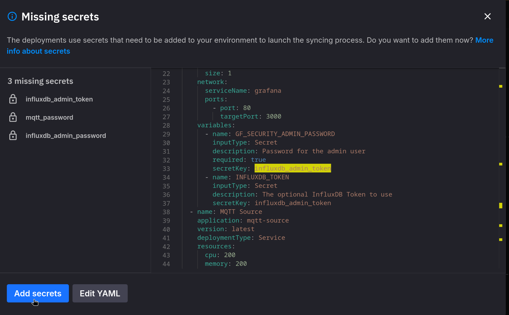
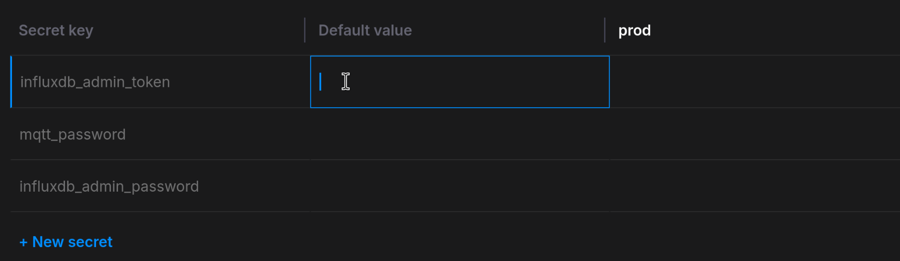
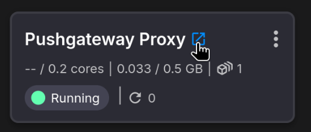
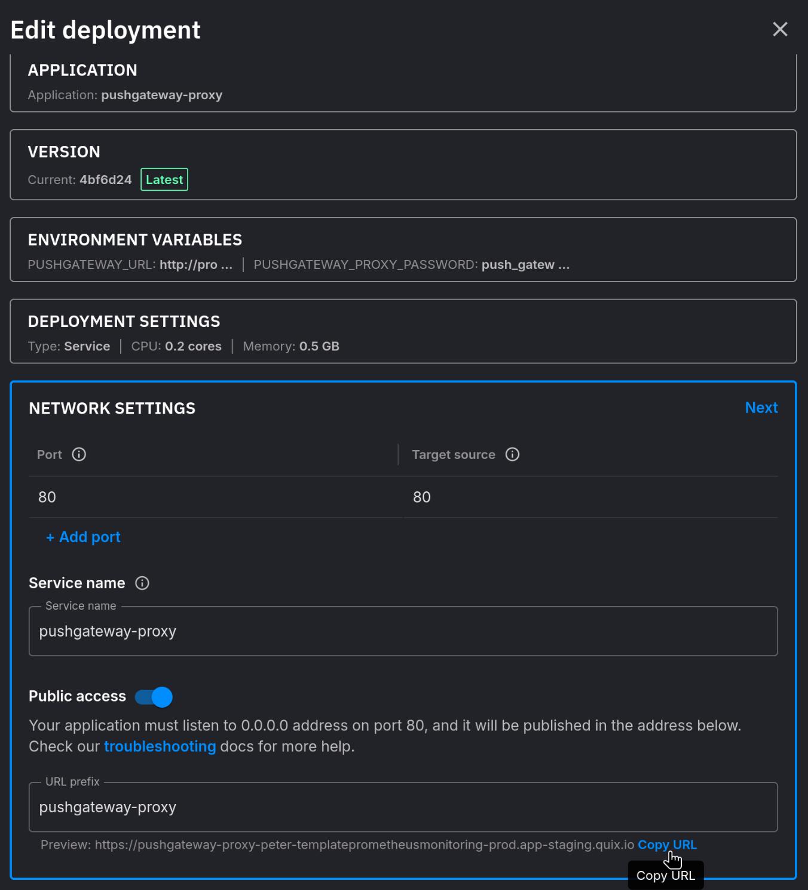
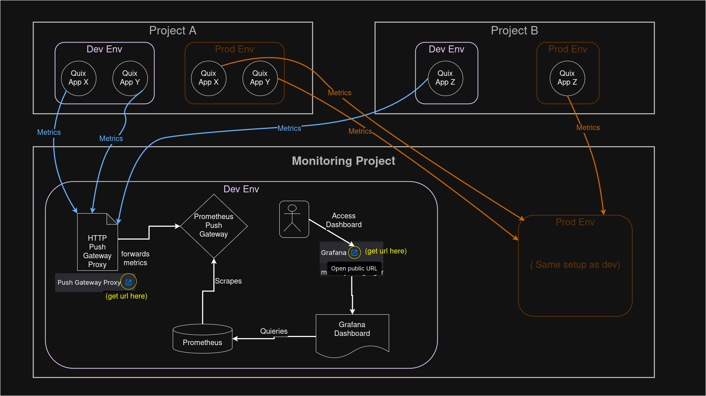
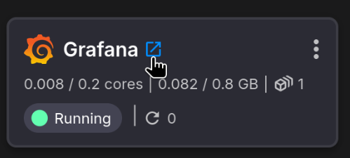
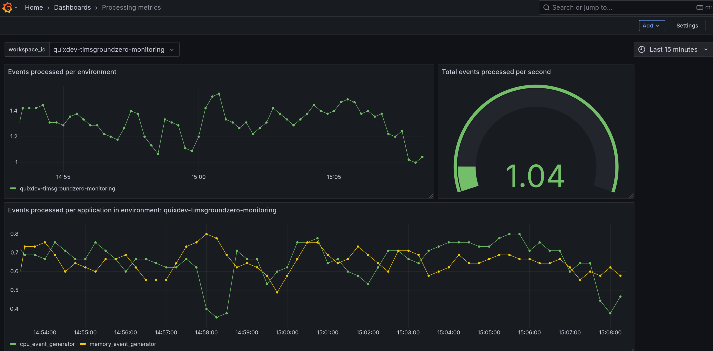

# Metrics and Monitoring Project Template

This template includes a set of services that enables a complete application 
metrics + monitoring stack using Prometheus + Grafana.

An example application is also included to show how to publish metrics to
the monitoring stack.

## Running the Template

### Syncing
Once the project is set up, an initial sync must be performed to deploy everything. 

Essentially, the cloud state must sync up to the current state of the new repository 
which now has a cloned version of the template.

Syncing is always a manually initiated operation that's available whenever updates 
to the code (underlying repository) happen.

### Setting Secrets

>**WARNING**: These secrets exist to act as an authentication layer since 
> ***some services are openly accessible to the entire internet***;
> as such: **DO NOT PICK WEAK PASSWORDS**.

Upon syncing, there will be a prompt to set up some project-level secrets (passwords). 
Simply choose a secure password for each.

Note that once set, you cannot view the values again. This largely only matters for 
services like Grafana, where users will be required to directly enter them for access to 
the UI, so make sure you save the value somewhere. 

Other services will reference these secrets directly in their project deployment 
configurations, so they do not need to be manually entered.

### Service Startup Delays and Application Restarts

Upon first sync, it is normal that some applications may restart/error a few times while 
some of its dependencies are still starting up.

Applications should not need to restart more than 3-5 times before everything is
up and running.

## How it Works

The `PushgatewayProxy` is set up to receive project-external traffic with an 
authenticated HTTP endpoint that Applications submit their Prometheus metrics to on 
a cadence (set by user, usually best to align with `Prometheus` scrape interval).

The `Pushgateway` service receives the forwarded request from the `PushgatewayProxy`
and stores them until `Prometheus` scrapes them.

On a `15s` cadence (set in `prometheus.yml`), the metrics are all then scraped by 
`Prometheus`, a time series database. The data is now catalogued and ready for use.

`Grafana`, a realtime dashboarding application (also gated with credentials), 
provides visualizations through custom-built queries made on the Prometheus instance.

## Publishing Metrics to Prometheus

### Pushgateway Proxy
To publish metrics to Prometheus, HTTP requests (containing Prometheus metrics) must be 
sent to the `Pushgateway Proxy` (see [how it works](#how-it-works) for more
info on the underlying stack).

#### HTTP Endpoint Url

To get the necessary HTTP endpoint path, simply navigate to the pipeline view and
copy the link presented by the `Pushgateway Proxy`:

You can also copy it in the deployment edit screen, including editing the prefix name, 
should you wish.

> NOTE: do not remove public access, otherwise applications external to the project will
> not be able to communicate with the proxy!

#### HTTP Endpoint Authentication

The `Pushgateway Proxy` also requires a password to send data to it. Use the same
password set for `pushgateway_proxy_pw` during [project syncing](#setting-secrets).

### Publishing Example

This template includes two different deployments of the `resource-usage-generator-app`,
called `CPU Usage Example App` and `RAM Usage Example App`.

The apps showcase publishing metrics to the `Pushgateway Proxy` using Python's `prometheus` 
library (it also handles the authentication).

To learn more, check out their `metrics_scraper.py` file which houses most of the data
scraping/pushing logic.

> Note: This example has the applications hitting a "localized" service endpoint on the 
> HTTP proxy for the sake of removing any additional user setup for the example. 
> When sending metrics from applications within other projects (as recommended),
> use the HTTP proxy url as [explained here](#publishing-metrics-to-prometheus).

## Intended Use of Monitoring Template

While this template has two example applications running in the same 
workspace to showcase how it works, in general you should deploy this monitoring 
stack independently of your applications.

This means you can have one centralized project for monitoring, with separate 
environments for handling dev or prod operations, for example.

Then, applications can send metrics to it from any other project using the respective 
`Pushgateway Proxy` URL + password, [as explained here](#publishing-metrics-to-prometheus).

## Grafana

### Accessing Grafana

Click on the blue link to log in to Grafana.

- **username**: `admin`
- **password**: whatever value `grafana_admin_pw` was set to when
  first setting up the template.

Then, navigate to the dashboards tab:

### Exploring the Example Dashboard

The included dashboard showcases how to show graphs that include various applications 
and separate them by the project (workspace) they originate from (of course, there is
only one project in the included example, which is the current project).

In this case, a raw count of average messages processed per app and per environment is 
shown.

### Adding/Editing Dashboards

You can edit dashboards interactively and import/export them as needed via JSON files,
which can then be added to the `/grafana/provisioning/dashboards` folder.

Other data sources can also be added, but only Prometheus is included in this example.

If state is used, you can create/edit dashboards and changes will persist as desired.

> NOTE: be sure to backup/export any important dashboards, which can provide useful 
> restore points.
