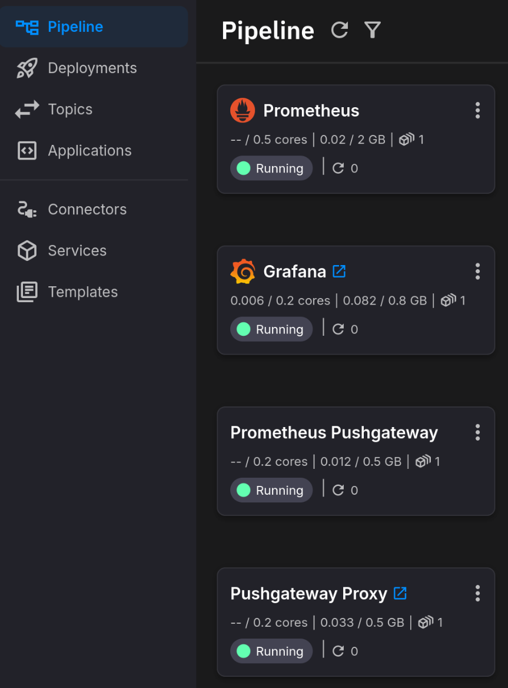
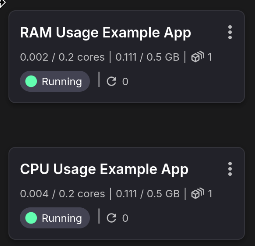
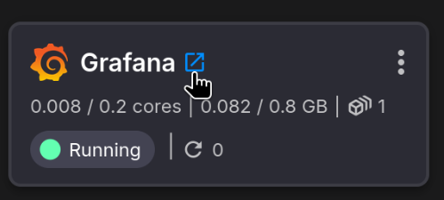
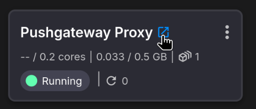
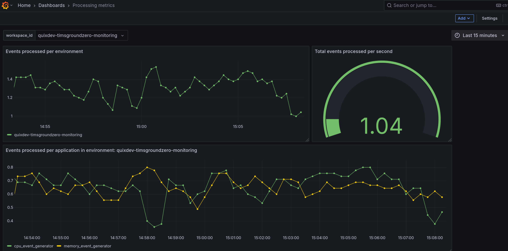

# Setup Guide

This guide walks you through the initial configuration and verification of your Metrics and Monitoring deployment.

## Step 1: Configure Secrets

After syncing the project, you'll be prompted to configure the following secrets:

| Secret | Description |
|--------|-------------|
| `pushgateway_proxy_pw` | Authentication token for the Pushgateway Proxy HTTP endpoint. Applications use this to send metrics. |
| `grafana_admin_pw` | Password for accessing the Grafana dashboard UI. |

Enter your secret values in the configuration form:

> **Security Warning**: Use strong, unique passwords for each secret. These services are publicly accessible via the internet.

## Step 2: Verify Deployment

After syncing and configuring secrets, verify that all services are running:

**Core Pipeline (ungrouped):**
- Prometheus
- Prometheus Pushgateway
- Pushgateway Proxy
- Grafana

**Example usage group:**
- CPU Usage Example App
- RAM Usage Example App

> **Note**: It's normal for services to restart a few times during initial deployment while dependencies start up. Services should stabilize after 3-5 restart cycles.

## Step 3: Access Services

### Grafana

1. Click the public URL link on the Grafana deployment

   

2. Log in with:
   - **Username**: `admin`
   - **Password**: The value you set for `grafana_admin_pw`

   

3. Navigate to the Dashboards tab to view the example dashboard

   

### Pushgateway Proxy

1. The public URL is available on the Pushgateway Proxy deployment

   

2. Applications sending metrics must include the `pushgateway_proxy_pw` for authentication
3. See the README for details on publishing metrics from your applications

## Step 4: Verify Data Flow

1. **Check example apps**: The CPU Usage Example App and RAM Usage Example App generate simulated resource metrics and push them to the Pushgateway Proxy

2. **Verify metrics in Prometheus**: Prometheus scrapes metrics from the Pushgateway every 15 seconds

3. **View in Grafana**: Navigate to Dashboards and select the example dashboard to see live data visualization showing CPU and RAM usage metrics

   

## Troubleshooting

### Services keep restarting

This is normal during initial deployment. Wait 2-3 minutes for all dependencies to initialize. Services should stabilize after a few restart cycles.

### No data in Grafana

1. Verify all services are running (green status)
2. Check that the example apps are successfully pushing metrics
3. Wait a few minutes for data to accumulate (Prometheus scrapes every 15 seconds)
4. Ensure the Prometheus data source is configured correctly in Grafana

### Cannot access Grafana

1. Verify the Grafana service is running
2. Check that public access is enabled on the deployment
3. Ensure you're using the correct credentials (`admin` / `grafana_admin_pw`)

### Metrics not reaching Pushgateway

1. Verify the Pushgateway Proxy service is running
2. Check that `pushgateway_proxy_pw` matches between the proxy and sending applications
3. Ensure applications are using the correct Pushgateway Proxy URL

### Example apps not sending metrics

1. Verify both CPU Usage Example App and RAM Usage Example App are running
2. Check that `PUSHGATEWAY_PROXY_URL` is set to `http://pushgateway-proxy`
3. Ensure the `pushgateway_proxy_pw` secret is configured correctly
