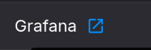

# Grafana

Grafana is an open-source analytics and visualization platform used to monitor metrics 
from various data sources like Prometheus, InfluxDB, and PostgreSQL. 

It lets you build interactive dashboards with graphs, tables, and alerts 
to track system performance, application behavior, or business KPIs. 

You can edit dashboards interactively and import/export them as needed via JSON files.

## How to Use

For this template, simply provide a password as generated by you during deployment.

Then, go to the public URL generated for the application and log in using `'admin'` and
your designated password.

You can quickly open the URL in Quix Cloud by opening the `deployments` list from the
left side panel and then clicking the blue box near the `Grafana` deployment name:

## Accessing the Provided Dashboard

Once authenticated, you can access the pre-made dashboard by navigating to "dashboards" 
from the top left menu (by clicking on the grafana icon).

To learn more about how to use Grafana, be sure to check out their docs.